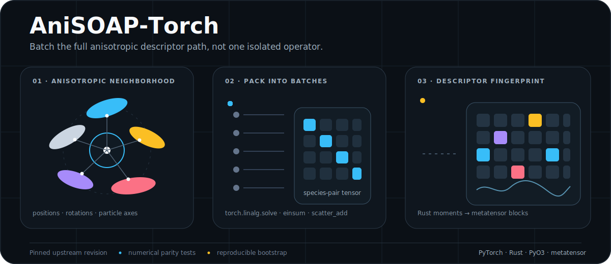
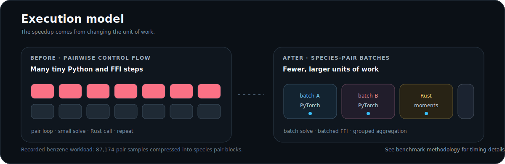

<div align="center">



**A focused performance-engineering artifact for anisotropic SOAP descriptors.**

[Benchmark methodology](docs/BENCHMARKS.md) · [Upstream AniSOAP](https://github.com/cersonsky-lab/AniSOAP) · [Apache-2.0](LICENSE)

</div>

## Why this exists

AniSOAP-Torch explores a specific systems question: what happens when the complete pairwise descriptor path is batched instead of accelerating one isolated NumPy operation?

The implementation preserves AniSOAP's mathematical structure while reorganizing execution around species-pair tensor batches. Dense linear algebra and contractions move to PyTorch, Gaussian moments cross into Rust in batches, and pair features are aggregated with grouped tensor operations.

This repository is an optimization artifact, not a separate AniSOAP distribution. `scripts/bootstrap.sh` reconstructs a pinned upstream revision, applies the modified files, and installs the resulting working tree.

## Execution model



The main change is execution granularity:

- pair metadata is gathered once for an entire species-pair block;
- Gaussian parameters and contractions are evaluated as tensor batches;
- the Rust recurrence is called once per block instead of once per pair;
- `scatter_add_` replaces Python-side feature accumulation.

The path is device-aware, but not end-to-end GPU-native. Rust moment evaluation and metatensor construction still cross CPU and NumPy boundaries.

## Measured results

| Workload | Frames | Upstream | Optimized | Observed speedup |
| --- | ---: | ---: | ---: | ---: |
| Benzenes | 50 | 10.43 s | 2.75 s | 3.79× |
| Ellipsoids | 50 | 0.408 s | 0.026 s | 15.69× |

These measurements were recorded on one Apple M4 system running macOS. They document the tested workloads, not universal performance guarantees. The exact setup, calculations, earlier experiments, and caveats are in [Benchmark Methodology](docs/BENCHMARKS.md); machine-readable values are stored in [`benchmarks/results.json`](benchmarks/results.json).

## Reproduce

Requirements: Python 3.10+, Git, Cargo, and a supported native build toolchain.

```bash
git clone https://github.com/Tejas7007/AniSOAP-Torch.git
cd AniSOAP-Torch
bash scripts/bootstrap.sh
source .venv/bin/activate
```

Run the numerical checks and benchmark:

```bash
pytest -q
python scripts/validate.py --frames 1
python scripts/benchmark.py --frames 50 --repeats 3
```

The bootstrap process creates `.worktree/AniSOAP` from the upstream revision pinned inside `scripts/bootstrap.sh`, applies only the modified Python and Rust files, creates `.venv`, and installs the reconstructed package in editable mode.

## Verification

The repository includes checks for batched Gaussian-parameter parity, batched Rust moment parity, finite descriptor outputs, and one-frame end-to-end execution. Source checks can be run locally with Ruff, Python compilation, `cargo fmt --check`, and `cargo check`.

The numerical equivalence claim is limited to the included tests and tolerances. It does not claim coverage of every AniSOAP configuration.

<details>
<summary><strong>Repository map</strong></summary>

| Path | Purpose |
| --- | --- |
| `anisoap/representations/` | Modified AniSOAP Python implementation files |
| `rust/` | Batched PyO3 and Rust moment implementation |
| `scripts/` | Reproducible setup, validation, and benchmarking |
| `tests/` | Numerical parity and integration checks |
| `benchmarks/results.json` | Recorded benchmark values and environment metadata |
| `docs/BENCHMARKS.md` | Methodology, implementation notes, and limitations |
| `NOTICE` | Upstream attribution and modification record |

</details>

## Scope

- The project reconstructs a pinned upstream worktree rather than publishing a standalone package.
- Benchmark data is loaded from the pinned upstream repository and is not duplicated here.
- Performance depends on hardware, compiler, BLAS, dependency versions, thread settings, and system load.
- Gradients are not implemented in the inherited projection path.

## Attribution

This optimization project was developed with the UW-Madison Data Science Institute Open Source Program Office and the Cersonsky Lab. It builds directly on AniSOAP and preserves the upstream Apache-2.0 license and author attribution.

See [NOTICE](NOTICE) and [CITATION.cff](CITATION.cff) for attribution and citation metadata.
